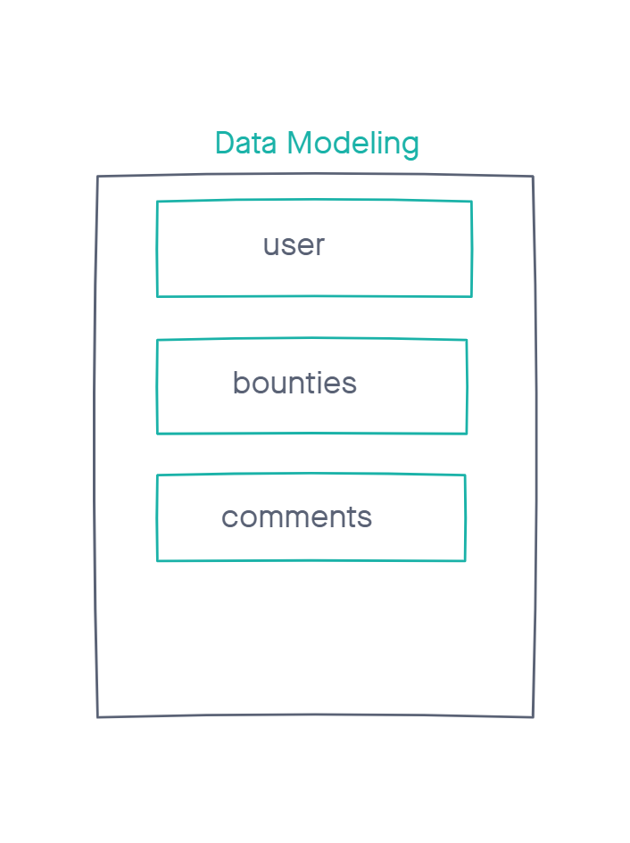
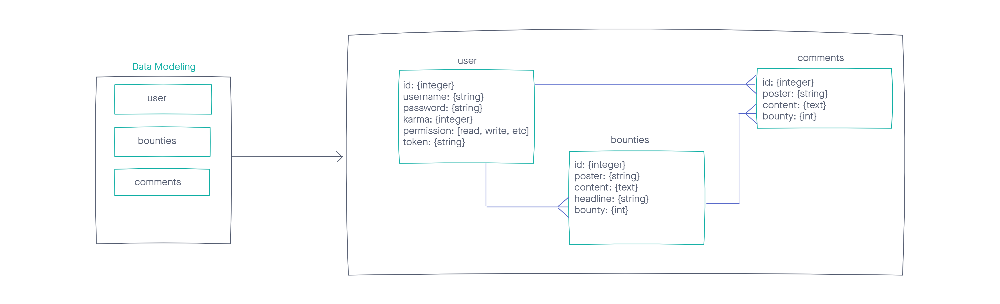
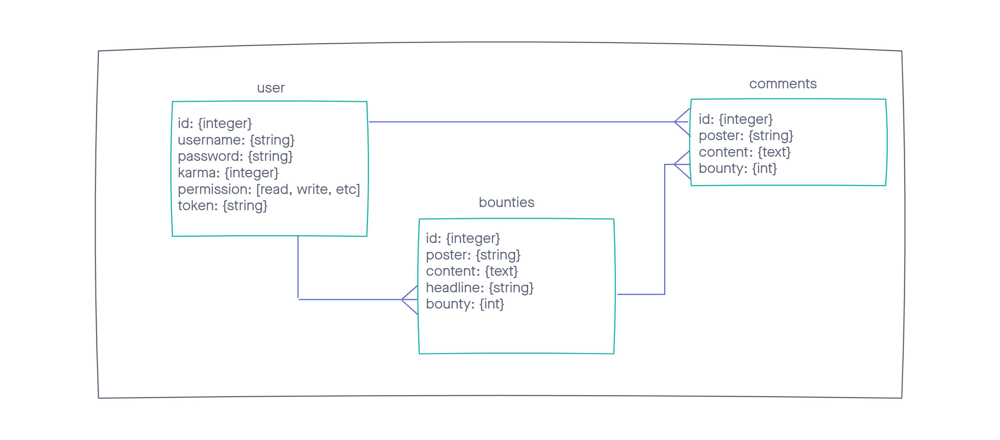
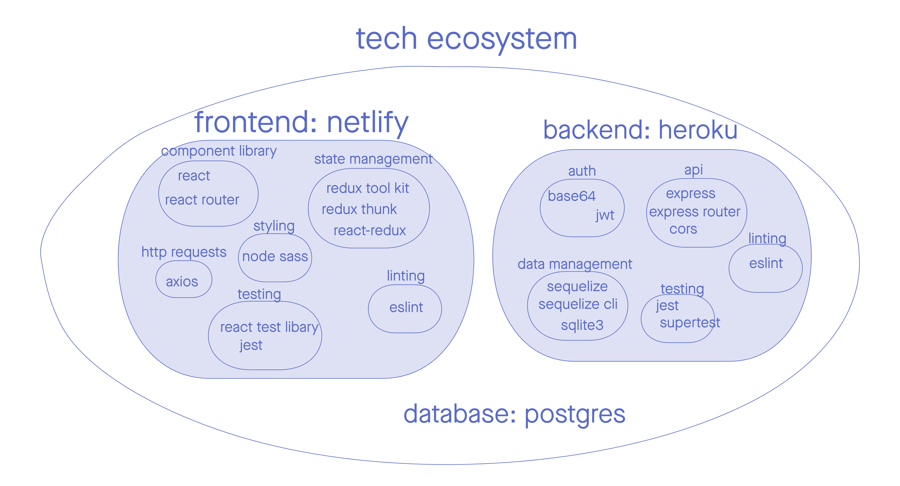
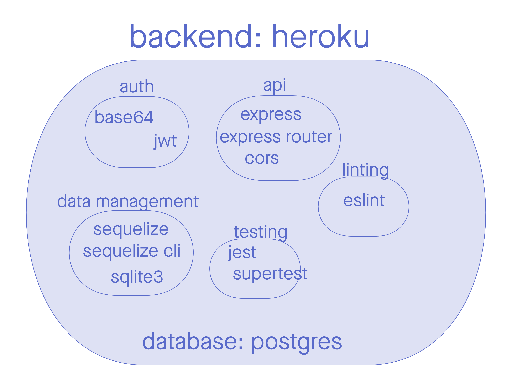

# bounty-back

# Team Cream Squad
- Cullen Sharp
- Sunny Lee
- Louis Lassgeue
- Tek Jones

## UML

### Database UML

## Setup

## Technologies

- [NodeJS]()
- [Base64]()
- [JSON Web Token (JWT)]()
- [Express]()
- [Express router]()
- [Cors]()
- [Sequelize]()
- [Sequelize cli]()
- [Sqlite3]()
- [Jest]()
- [Eslint]()
- [Postgres]()
- [Heroku]()

## Links
- [Bounty frontend code](https://github.com/Creams-Quad/bounty-front)
- [Bounty backend deployment]()
- [Bounty Website]()
