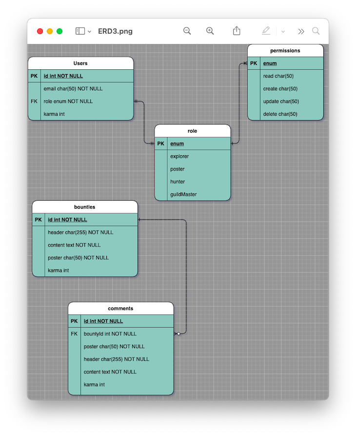

# Bounty Back


## 🚀 Getting Started

1. Fork our repo [GitHub](https://github.com/Creams-Quad/bounty-back)
1. Clone the repo `git clone`
1. Install dependencies `npm i`
1. Run tests `npm test`
1. Start a development server `npm start`

## 📖 Table of Contents

### [API Reference](#-API-Reference)

### [Entity Relationship Diagram](#-Entity-Relationship-Diagram)

### [Our Repos](#-Our-Repos)

### [Team](#-Team)

### [More Resources](#-More-Resources)

### [Team Agreement](./TeamAgreement.md)

## 🛠 API Reference

### /login

- `POST`
  - Description: creates and returns user credentials from a JWT token
  - Status code: (200)
  - No json input
  - Auth:
    - Auth0 JWT
  - Example output

```JSON
{
  "id": 1,
  "email": "John@doe.mail",
  "role": "guildMaster",
  "permissions: ["read", "update", "create", "delete"]
}
```

### api/v1/bounties

- `POST`
  - Description: Creates a new bounty with an id and add it to the bounties table
  - Status code: (200)
  - Auth:
    - Auth0 JWT
    - 'create' permission
  - JSON input:
    - header: {string}
    - content: {string}
    - karma: {integer}

```JSON
{
  "id": 1,
  "header": "foo",
  "content": "bar",
  "poster": "John Doe",
  "karma": 100,
}
```

- `GET`
  - Description: Return a list of all bounties
  - Status code:(200)
  - Auth:
    - Auth0 JWT
    - 'read' permission
  - No JSON Input
  - Example output

```JSON
{
  "id": 1,
  "header": "foo",
  "content": "bar",
  "poster": "John Doe",
  "karma": 100,
}
```

### api/v1/bounties/:id

- `PUT`
  - Description: Updates a bounty within the bounties table on a given id
  - Status code:(200)
  - Auth:
    - Auth0 JWT
    - 'update' permissions
  - JSON input:
    - header: {string}
    - content: {string}
    - poster: {string}  
  - Example output

```JSON
{ 
  "id": 1,
  "header": "foo",
  "content": "bar",
  "poster": "John Doe"
}
```

- `GET`
  - Description: Return a bounty with related comments
  - Status code:(200)
  - Auth:
    - Auth0 JWT
    - 'read' permissions
  - No JSON input
  - Example output

```JSON
{
  "id": 1,
  "header": "foo",
  "content": "bar",
  "poster": "John Doe",
  "karma": 100,
  "comments": [
    {
      "id": 1,     
      "bountyId": 1,
      "header": "fizz",
      "content": "buzz",
      "poster": "Holly Doe",
      "karma": 100
    }
  ]
}

```

- `DELETE`
  - Description: Delete bounty from table
  - Status code:(204)
  - Auth:
    - Auth0 JWT
    - 'delete' permissions
  - No JSON input
  
### api/v1/comments

- `POST`
  - Description: Creates a comment record to comments table
  - Status code:(200)
  - Auth:
    - Auth0 JWT
    - 'create' permissions
  - JSON input:
    - header:{string}
    - content:{string}
    - poster:{string}
  - Example output

```JSON
{
  "id": 1,
  "bountyId": 1,
  "header": "fizz",
  "content": "buzz",
  "poster": "Holly Doe",
}
```

### api/v1/comments/:id

- `PUT`
  - Description: update a comment from comments table on an given id
  - Status code:(200)
  - Auth:
    - Auth0 JWT
    - 'update' permissions
  - JSON input:
    - header:{string}
    - content:{string}
    - poster:{string}
  - Example output

```JSON
{
 "id": 1,
 "header":"fizz",
 "content":"buzz",
 "poster":"Holly Doe",
}
```

- `GET`
  - Description: return a comment from comments table on an given id
  - Status code:(200)
  - Auth:
    - Auth0 JWT
    - 'read' permissions
  - No JSON input
  - Example output

```JSON
{
  "id": 1,     
  "bountyId": 1,
  "header": "fizz",
  "content": "buzz",
  "poster": "Holly Doe",
  "karma": 100
}
```

- `DELETE`
  - Description: delete a comment from comments table on an given id
  - Status code:(204)
  - Auth:
    - Auth0 JWT
    - 'delete' permissions
  - No JSON input

## 🏢 Entity Relationship Diagram



## 🚧 Our Repos

- [Bounty frontend](https://github.com/Creams-Quad/bounty-front)

## 🏡 Team

- Cullen Sharp
- Sunny Lee
- Louis Lassegue
- Tek Jones

## 🔍 More Resources

- [Project Management Board](https://www.notion.so/Cream-Squad-2eecc388ea1a4a70b6992435f3e885a8)
