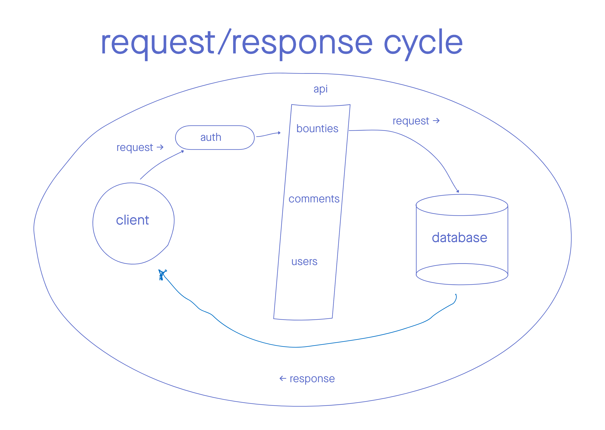

# bounty-back

# Team Cream Squad
- Cullen Sharp
- Sunny Lee
- Louis Lassegue
- Tek Jones

## UML

### Web Request/Response Cycle UML


### Database UML


## Setup
1. To setup the app you want to first `fork` repository from [GitHub](https://github.com/Creams-Quad/bounty-back)
2. In the fork repository click the green `code` tab. A drop down to copy the repository link or url will be shown. Copy that link.
3. Go to your local machine terminal and `cd` into a directory or folder to copy link.
4. In that directory or folder type in `git clone (with the copied link)`
5. Type in `npm install` to install all dependencies for the app.

## Routes

### /bounties:
  - POST
    - description: create a new bounty with an id and add it to the bounties table
    - status code:(200)
    - JSON input:
      - username:{string}
      - password:{string}
  - GET
    - description: 
    - status code:(200)
    - no JSON Input

### /bounties/id:
  - PUT
    - description: update a bounty with in the bounties table on a given id
    - status code:(200)
    - JSON input:
      - header:{string}
      - content:{string}
      - poster:{string}  
      <!-- - username:{string}
      - password:{string} -->
  - GET
    - description: return a bounty with related comments
    - status code:(200)
    - no JSON input
    - Example output
       ```JSON
      {
      "id":1,
      "header":"foo",
      "content":"bar",
      "poster":"John Doe",
      "karma":100,
      "comments": [
        {
          "id":1,     
          "bountyId":1,
          "header":"fizz",
          "content":"buzz",
          "poster":"Holly Doe",
          "karma":100
        }]
      }
  - DELETE
    - description: delete bounty from table
    - status code:(204)
    - no JSON input
  

### /comments:
  - POST
    - description: add a comment to comments table
    - status code:(200)
    - JSON input:
      - header:{string}
      - content:{string}
      - poster:{string}  

  <!-- - method: DELETE
    - status code:(204)
    - description: delete data from database
    - no JSON input -->

### /comments/id:
  - PUT
    - description: update a comment from comments table on an given id
    - status code:(200)
    - JSON input:
      - header:{string}
      - content:{string}
      - poster:{string}  
  - GET
    - description: return a comment from comments table on an given id
    - status code:(200)
    - description: return data from database
    - no JSON input
    - Example output
       ```JSON
      {
        "id":1,     
        "bountyId":1,
        "header":"fizz",
        "content":"buzz",
        "poster":"Holly Doe",
        "karma":100
      }
  - DELETE
    - description: delete a comment from comments table on an given id
    - status code:(204)
    - no JSON input

    

## Technologies


- [NodeJS](https://nodejs.org/en/docs/): 
- [Base64]()
- [JSON Web Token (JWT)]()
- [Express]()
- [Express router]()
- [Cors]()
- [Sequelize]()
- [Sequelize cli]()
- [Sqlite3]()
- [Jest]()
- [Eslint]()
- [Postgres]()
- [Heroku]()
- [Notion]()

## Links
- [Project Management Board](https://www.notion.so/Cream-Squad-2eecc388ea1a4a70b6992435f3e885a8)
- [Bounty frontend code](https://github.com/Creams-Quad/bounty-front)
- [Bounty backend deployment]()
- [Bounty Website]()
